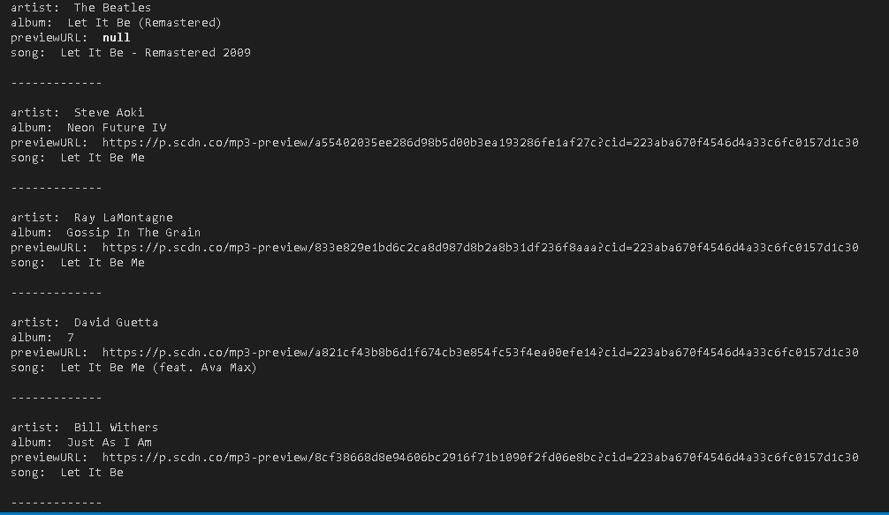
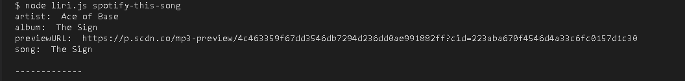
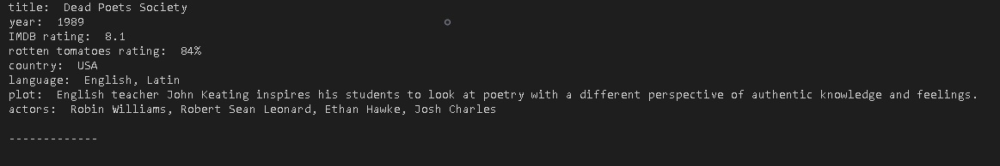
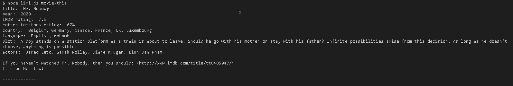
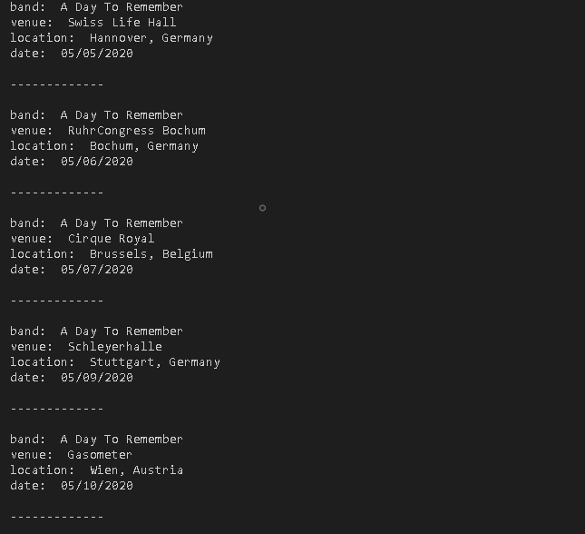
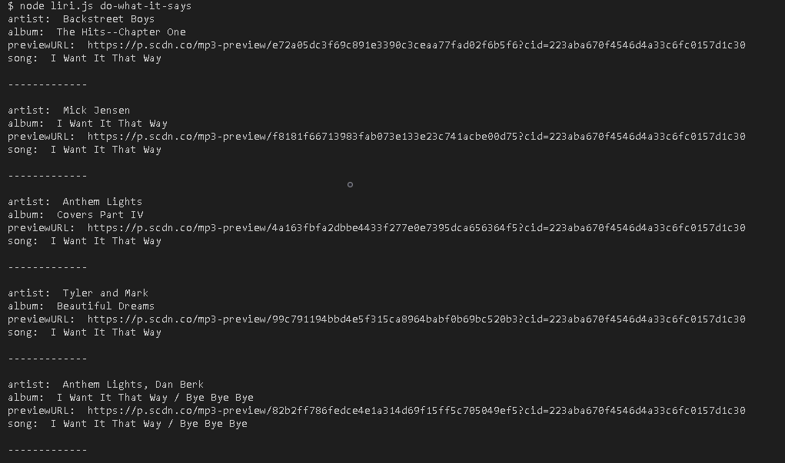

# liri-node-app

The app performs API calls to Spotify, OMDB, and Bands in Town, to print off infomation based on a node terminal search.

---

## Technologies Used

- [Spotify API](https://www.npmjs.com/package/node-spotify-api) _returns songs from spotify_ 
- [OMDB API](https://www.omdbapi.com) _returns movies from OMDB_
- [Bands in Town API](https://www.artists.bandsintown.com/bandsintown-api) _returns concert information for a band/artist from Bands in Town_
- [Axios](https://www.npmjs.com/package/axios) _Promise based HTTP client for the browser and node.js_
- [fs](https://nodejs.org/api/fs.html) _module for reading and writing files_
- [Moment](https://www.npmjs.com/package/moment) _used to format time and dates_
- [Dotenv](https://www.npmjs.com/package/dotenv) _Dotenv is a zero-dependency module that loads environment variables from a .env file into process.env_
- [Node.js](https://nodejs.org/en/docs/) _an asynchronous event-driven JavaScript runtime, Node.js is designed to build scalable network applications_

---

## Prerequists

- [Spotify module](https://www.npmjs.com/package/node-spotify-api) _npm install --save node-spotify-api_
- [Axios module](https://www.npmjs.com/package/axios) _npm install axios_
- [Moment module](https://www.npmjs.com/package/moment) _npm install moment_
- [Dotenv module](https://www.npmjs.com/package/dotenv) _npm install dotenv_

---

## Setup

- Generate the spotify id and the spotify secret:
    - Go to <https://developer.spotify.com/my-applications/#!/>
    - Log into your existing spotify account ofr create a new one.
    - Once you are logged in go to <https://developer.spotify.com/my-applications/#!/applications/create> to register an application for use with the Spotify API
    - Copy the values for the spotify id and spotify secret.

- Create a file named `.env` and place the following into it:

```js
# Spotify API keys

SPOTIFY_ID=your-spotify-id
SPOTIFY_SECRET=your-spotify-secret

```
- Replace the values with the spotify keys.

---

## Product Features

- The app takes a terminal command and then will run an API search based on what has been input into the terminal. The different terminal inputs have been outlined below.

### Spotify API

- In the terminal the user will type "node liri.js spotify-this-song 'song-name-here'". 


- Then once the search has been completed the console will have printed out 5 results for the song name listing the artists name, the song name, a preview link for the song from Spotify, and the album name that the song is on.



- If no song is listed in the third arguement for "spotify-this-song" then a default search will be run for the song "The Sign" by Ace of Base. The results for this will also list the artists name, the song name, a preview link from spotify, and the album name.



### OMDB API

- The OMDB API uses the axios module to perform the terminal command "movie-this" to search OMDB for a movie title. In the terminal the user will type "node liri.js movie-this 'movie-title-here'". 


- Then once the search has been completed the console will print out the movie result for the movie searched listing the title of the movie, year the movie was released, IMDB rating, Rotten Tomatoes rating, the country where the movie was produced, the language the movie is in, the movie plot, and the actors in the movie.



- If no movie is listed in the third arguement for "movie-this" then a default search will be run for the movie "Mr. Nobody". The results for this will also list the title of the movie, year the movie was released, IMDB rating, Rotten Tomatoes rating, the country where the movie was produced, the language the movie is in, the movie plot, and the actors in the movie.



### Bands in Town API

- The Bands in Town API uses the axios module to perform the terminal command "concert-this" to search Bands in Town for concert information for a specific band. In the terminal the user will type "node liri.js concert-this 'band-name-here'".


 - Then once the search has been completed the console will print out five concert results for the band searched. The console will list the band name, the name of the venue, the venue location, and the date of the event using moment to format the date as "MM/DD/YYYY".



### Randdom.txt File

- The user is also able to change the text within the 'random.txt' file to perform any of the above searches. The user will open up the 'random.txt' file and on the first line add one of the following: 'spotify-this-song,"song-name-here"', 'concert-this,"band-name-here", or 'movie-this,"movie-title-here". 


- The 'fs' node package will then be used to perform one of the above switch cases based on what has been put into the 'random.txt' file.



---

## Author

- [Kortnie Heidel](mailto:kortnie.evans@gmail.com)